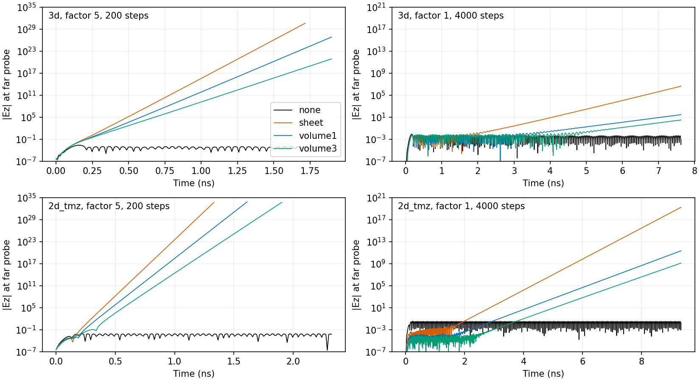
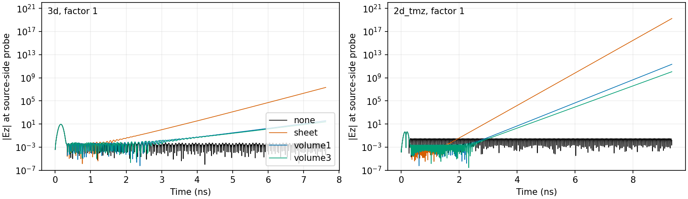

# ADI interior PEC: measured instability and refusal (2026-09-08)

Decision: refuse interior PEC on **both 3-D and 2-D TMz ADI at every factor**.
The named preflight finding is `adi_interior_pec_unsupported` (error).
The shipped default remains 5 for models without interior PEC. Use Yee to
retain a declared conductor; neither dropping metal nor silently reducing dt
is an acceptable remedy.

## Evidence before the decision

Initially measured on baseline `6b8101de` in `feat/931-adi-guard`, before
adding the guard. The committed artifacts were regenerated by a complete
104-case replay with only the new guard bypassed; their reported peaks and
non-finite counts were checked against these pre-decision tables. A separate
single-case replay also reproduced the default failure exactly.
CPU JAX 0.6.2, float32, `JAX_PLATFORMS=cpu`. Uniform 20 mm cube at dx = 1 mm,
PEC domain boundaries, vacuum, default 15 GHz soft Ez source. The 3-D sheet
is x/y = [4,16] mm at z = 10 mm; one- and three-cell volumes extend its upper
z face to 11 and 13 mm. Source (10,10,5) mm, far probe (10,10,15) mm. A second
live probe is at the source. This exactly reproduces the review's 3-D default
sheet failure: largest finite far sample 4.078159834511045e30, then 19
non-finite samples; the empty control is 0.00232095830142498.

For TMz, z is collapsed by the production grid. The sheet is normal to y,
x = [4,16] mm, y = 10 mm, spanning z = [0,20] mm, so Ez is tangential and
actually blocked. Volumes extend y to 11 or 13 mm. Source (10,5,0) mm,
far probe (10,15,0) mm. This is a polarization-appropriate comparison of
conductor classes, **not** a dimensional-reduction equivalence of the 3-D
geometry (whose sheet-normal Ez stays live). Each mode uses its own grid dt;
equal step counts across factors are not equal physical horizons.

104 small solves were serialized: 48 at 200 steps, 40 near-transition cases
at 800 steps, and 16 at 4,000 steps to falsify the alleged factor-1 fallback.
The initial sweep's longest measured solve body took 22.81 s; each initial subprocess had a
60 s timeout and each reused-interpreter case a 60 s watchdog. This is
stability evidence for these fixtures, not a throughput benchmark.

Table entries are **largest finite |Ez| (non-finite sample count)** at the
far probe. A finite peak is deliberately not called a passing stability gate.

### 200 steps

| Lane | Factor | Empty | Sheet | 1-cell volume | 3-cell volume |
|---|---:|---:|---:|---:|---:|
| 3d | 0.5 | 0.01651598 (0) | 0.009514791 (0) | 0.01013672 (0) | 0.01209715 (0) |
| 3d | 1 | 0.008298249 (0) | 0.00523057 (0) | 0.005597187 (0) | 0.007169631 (0) |
| 3d | 1.5 | 0.005587234 (0) | 0.006387345 (0) | 0.004133583 (0) | 0.00491218 (0) |
| 3d | 2 | 0.004266505 (0) | 2.389233 (0) | 0.1072815 (0) | 0.03805903 (0) |
| 3d | 3 | 0.003027686 (0) | 9.70627e+09 (0) | 962631.8 (0) | 43468.6 (0) |
| 3d | 5 | 0.002320958 (0) | 4.07816e+30 (19) | 6.935343e+26 (0) | 7.774614e+20 (0) |
| 2d_tmz | 0.5 | 0.07084549 (0) | 0.0004057485 (0) | 0.0001358222 (0) | 0.0001419892 (0) |
| 2d_tmz | 1 | 0.03555425 (0) | 0.0006320505 (0) | 0.0001251314 (0) | 0.0001058292 (0) |
| 2d_tmz | 1.5 | 0.02380235 (0) | 0.02312597 (0) | 0.000347384 (0) | 9.002914e-05 (0) |
| 2d_tmz | 2 | 0.01806672 (0) | 34664.64 (0) | 1.995772 (0) | 1.864244 (0) |
| 2d_tmz | 3 | 0.01243023 (0) | 9.334943e+21 (0) | 1.646907e+14 (0) | 3.781621e+12 (0) |
| 2d_tmz | 5 | 0.008246382 (0) | 4.758624e+33 (85) | 6.913905e+33 (61) | 4.902234e+33 (36) |

### 800 steps

| Lane | Factor | Empty | Sheet | 1-cell volume | 3-cell volume |
|---|---:|---:|---:|---:|---:|
| 3d | 1 | 0.008298249 (0) | 0.007316875 (0) | 0.005804539 (0) | 0.007196374 (0) |
| 3d | 1.25 | 0.006676121 (0) | 0.9253126 (0) | 0.01927811 (0) | 0.008061309 (0) |
| 3d | 1.5 | 0.005587234 (0) | 13369.38 (0) | 5.944021 (0) | 1.292948 (0) |
| 3d | 1.75 | 0.004835709 (0) | 7.727976e+09 (0) | 23751.27 (0) | 3100.365 (0) |
| 3d | 2 | 0.004266505 (0) | 1.435384e+17 (0) | 1.340096e+09 (0) | 3.872146e+07 (0) |
| 2d_tmz | 1 | 0.03555425 (0) | 0.01588014 (0) | 0.00035141 (0) | 0.0001058292 (0) |
| 2d_tmz | 1.25 | 0.02846977 (0) | 24414.46 (0) | 6.298009 (0) | 0.2996538 (0) |
| 2d_tmz | 1.5 | 0.02380235 (0) | 1.171142e+13 (0) | 5825770 (0) | 420750.2 (0) |
| 2d_tmz | 1.75 | 0.02059957 (0) | 1.787738e+24 (0) | 1.70126e+14 (0) | 2.220675e+13 (0) |
| 2d_tmz | 2 | 0.01806672 (0) | 5.697585e+33 (72) | 9.79982e+22 (0) | 3.712105e+22 (0) |

### 4,000 steps

| Lane | Factor | Empty | Sheet | 1-cell volume | 3-cell volume |
|---|---:|---:|---:|---:|---:|
| 3d | 0.5 | 0.01651598 (0) | 0.009996326 (0) | 0.01110113 (0) | 0.01445494 (0) |
| 3d | 1 | 0.008298249 (0) | 4325304 (0) | 29.10443 (0) | 3.154451 (0) |
| 2d_tmz | 0.5 | 0.07084549 (0) | 0.004539284 (0) | 0.0002386301 (0) | 0.0001759914 (0) |
| 2d_tmz | 1 | 0.03555425 (0) | 1.773637e+19 (0) | 2.18676e+11 (0) | 1.273245e+09 (0) |

## Interpretation and limits

At 200 steps, factor 1.5 looks innocuous in 3-D. At 800 steps its sheet
reaches 13,369 and its volumes also grow. At factor 1, the 3-D sheet's
successive 1,000-step peaks are 0.01310646, 4.107609, 3826.383, 4,325,303.5;
the empty control's late peaks stay near 0.00455. Its final fields have a maximum finite component entry of 5.4635e9
(a diagnostic over E and H, not an energy norm). At the default factor 5, the final 3-D sheet fields contain
44,004 non-finite entries. These witnesses rule out an artifact confined to
the far probe or its peak extraction.

The source-side probe independently shows the same late growth. Visual
inspection of both saved figures confirms sustained approximately exponential
growth after the pulse, with bounded oscillatory empty controls. The sheet
usually grows fastest; a thicker volume delays/reduces growth, but neither
volume class removes it. TMz's interior PEC is not a safe alternative.

The observed transition is horizon-dependent: all three classes grow strongly
at factor 1 by 4,000 steps, while factor 0.5 has no comparable runaway over
that horizon. This brackets the **observed** failure for these fixtures;
it is not an asymptotic stability threshold. The TMz factor-0.5 sheet's
window peaks change (0.00206, 0.00381, 0.00454, 0.00437), so even that case
must not be sold as a proof of stability. No universal safe positive factor
was established, and the sweep did not test every orientation, wire shape,
material interface, mesh, precision, or duration.





## Why refusal

The unchanged kernels apply internal PEC through RHS/post-solve projection,
not an internally constrained implicit operator. The homogeneous splitting
argument therefore does not establish stability for this implementation with
interior conductors. This is a mechanism-level research lead; no contained,
demonstrated numerical correction was established here.

A default warning alone still permits the reproduced overflow. A clamp at 1
is falsified by the long runs. Choosing 0.5 merely moves the unproved-bound
problem. Refusal at every factor is consequently an unsupported-configuration
policy, **not** a claim that every possible PEC configuration is unstable.
It also covers wires conservatively; no wire-specific stability threshold
was measured. BoundarySpec PEC faces are unaffected.

The guard is structural: any supplied internal mask is refused, including an
all-false mask, so no host boolean conversion of a JAX tracer is needed.
Use `None` for absent low-level masks. A declared PEC body touching a domain
wall still counts as an internal geometry input. Only domain boundary faces
are exempt. `pec_occupancy_override` had no ADI carrier and is now refused
explicitly instead of silently disappearing.

## Changes and regression coverage

- The common `run()` / `forward()` ADI path still receives sheet and wire
  collections and calls the shared realized-edge owner before refusing.
  Tests spy on both calls and assert nonempty realized edges. No conductor
  forwarding or numerical update equation was removed or changed.
- Low-level 2-D/3-D step and run APIs refuse masks too, before scan or JIT.
- Preflight uses production assembly and reports a named error; inability to
  evaluate assembly is explicit. Skipping preflight cannot bypass execution.
- Corrected the preflight message and its explanatory text, the Simulation
  API documentation, the kernel documentation, and the public ADI guide.
  The CFL-independent argument is scoped to the homogeneous, lossless split
  with compatible domain boundaries; it guarantees neither projected PEC
  stability, arbitrary material-interface behavior, nor wavelength accuracy.
- Shipped-default tests omit the factor argument and assert the constructor
  remains 5. They pin refusal for both modes, run/forward (including skipped
  preflight), sheet/one-cell/thicker-volume/wire inputs, call-time mask and
  occupancy overrides, and JIT/grad. A forbidden-solve spy proves the default
  fails before numerical execution. Non-PEC and loss-only controls remain.
- Removed the misleading `ADI_STABLE_CFL` test constant. Unsupported short
  numerical witnesses now assert refusal; exact owner/projection assertions
  remain. No existing numerical tolerance was loosened. The existing
  unmasked cavity/gradient controls now JIT-compile their unchanged update
  and AD witnesses to avoid repeated CPU scan compilation; step counts and
  assertions are unchanged.

## Reproduction and artifacts

`adi_pec_stability/metrics.json` contains all 104 measured case summaries,
including timestep, four window peaks, final-field witnesses and duration.
`adi_pec_stability/traces.npz` contains 105,600 two-probe time samples, keyed
by `mode_kind_factor_steps`; NaN marks non-finite samples. Column 0 is the
far probe and column 1 the independent source-side probe.

The explicitly named diagnostic bypass is only in the reproduction script;
there is no supported Simulation opt-in to run the refused configuration.
Reproduce in this worktree on an idle CPU allocation:

```bash
JAX_PLATFORMS=cpu PYTHONPATH=. OMP_NUM_THREADS=1 OPENBLAS_NUM_THREADS=1 \
  timeout 1200 taskset -c 0-3 python scripts/diagnostics/adi_pec_stability.py \
  --sweep --unguarded-measurement --output adi-remeasurement
python scripts/diagnostics/adi_pec_report.py adi-remeasurement adi-report
```

To settle the numerics requires deriving the constrained split operator,
checking its amplification spectrum or a discrete energy estimate (including
internal PEC rows), and validating a candidate correction over orientations,
conductor classes, material contrasts, grid refinement and long source-free
evolution. A finite short trace or a zero probe inside metal is not sufficient.
That work, and a rigorous stability bound, remain open.

The prescribed historical `rfx-known-issues.md` is absent in this worktree;
no other worktree was consulted. The local #931 design note is authoritative:
a sheet owns no cell, and every consumer must use the realized-edge owner.
The guard preserves that requirement. R2 non-closing numerical-fix attempts: 0;
this work measured the envelope and introduced a refusal, not a numerical fix.

## Verification on the final change

One completed pytest batch, `JAX_PLATFORMS=cpu`, `timeout 1200`, `-n 4`,
`-m ''` (including the runner file's GPU-marked tests on CPU):

| Test file | Passed | Failed | Errors | Skipped |
|---|---:|---:|---:|---:|
| `tests/contracts/test_pec_lane_parity_numeric.py` | 25 | 0 | 0 | 0 |
| `tests/unit/preflight/test_adi_preflight.py` | 29 | 0 | 0 | 0 |
| `tests/unit/preflight/test_preflight_advisory_emission_contract.py` | 3 | 0 | 0 | 0 |
| `tests/unit/runners/test_adi.py` | 20 | 0 | 0 | 0 |
| `tests/unit/runners/test_adi_gradient.py` | 4 | 0 | 0 | 0 |
| **Total** | **81** | **0** | **0** | **0** |

Elapsed 31.55 s; slowest test 21.28 s. There were 100 warnings (existing
source-amplitude deprecations and expected preflight diagnostics).
`adi_pec_stability/validation.json` records every case and its duration.
An earlier preflight-only batch also passed 32/32. Two intermediate full
batches were deliberately stopped (pod pytest overlap, then unjitted control
runtime); neither is counted as a completed pass. No other user's process
was modified.

`git diff --check` and Ruff on the other touched Python files pass.
Ruff on `_execute.py` still reports its pre-existing E741 (`l`), outside this
diff. AST comparison against the baseline verifies all four ADI numerical
function bodies are identical after removing only the new guard calls and
docstrings. Full public-site build and wider repository tests were not run.
