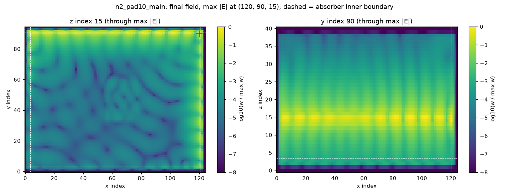
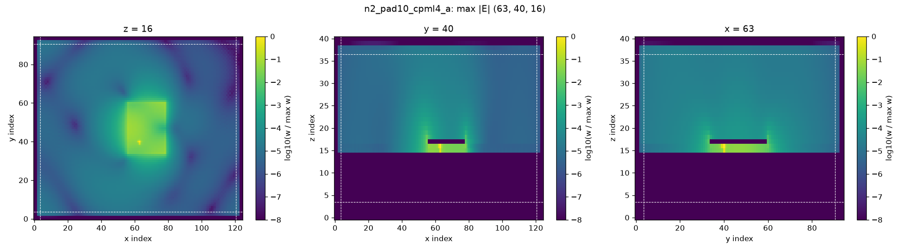

# The open-boundary contract: what touches an absorbing face, and what the absorber may end

Status: **decided** (PI, 2026-09-21). Option A of section 5 is adopted; option B is the next task, not a
rejected one. This note is the rule; the code that implements it lands in later changes and cites it.
Every number here is read from a record under `scripts/diagnostics/open_boundary_contract/` (file and
key given in place) or from a tracked file named in place. Nothing in `rfx/` changes with this note.

## 1. The physics the rule protects

An absorbing boundary (PML, and rfx's CPML) is a stretch of the coordinate normal to the face. It is
reflectionless for ANY field that solves Maxwell's equations in the medium at its face, the guided
modes of an inhomogeneous cross-section included, on one condition: **the cross-section at the face
continues unchanged along the normal through the absorber.** A second, independent condition is that
the absorber really absorbs what the structure delivers to it: a mode with no cutoff delivers energy
down to zero frequency, and a wave travelling parallel to the face is hardly absorbed at all.

Where either condition fails the result is not slightly less accurate, it is unphysical. Measured on
rfx: a lossless patch on a grounded substrate gains energy (+2.55e-3 per step in field amplitude,
`result_main.json`, arm `n2_pad10_cpml4`); a microstrip line whose strip is put inside the absorber
loses 35 to 46 dB of ring-down over its two drives and three orders of magnitude of reciprocity
(`msl_inset/TABLE.md`).

## 2. How two reference solvers avoid the question, and why rfx cannot

| | where the absorber is | who decides what is inside it | the absorber |
|---|---|---|---|
| Meep | inside the cell: "the PML layer is *inside* the cell, overlapping whatever objects you have there" (Python tutorial, *A Straight Waveguide*) | the user, by drawing through it; the tutorial's waveguide is a block of infinite length | graded conductivity |
| openEMS | the outer N cells of the user's mesh (`PML_8`) | the user, by drawing to the outermost mesh line: in `python/Tutorials/MSL_NotchFilter.py` the strip starts at the outermost x mesh line and the substrate spans the first to the last mesh line; the ground is a PEC boundary. Without a lumped `Feed_R` "port has to start in an absorbing boundary such as a PML" (Ports page) | graded conductivity only; PML cells take the effective material at their own position from the user's mesh (`FDTD/extensions/operator_ext_upml.cpp`, `Calc_EffMatPos`); metal drawn there is in the same operator coefficients the PML modifies (reading of that file, not a statement it makes) |
| rfx | cells ADDED OUTSIDE the declared domain | rfx, because the user cannot draw there | graded conductivity, kappa = 1, plus a frequency-shift term `alpha = 0.05·(1 − rho)` S/m (`rfx/boundaries/cpml.py`) |

Both manuals state the failure this contract is about. Meep: "wave media that are inhomogeneous in the
boundary-normal directions … cause PML to break down" (PML page); and its FAQ: "The decay coefficient
of the fields within any PML contains a cos(θ) factor … The decay therefore becomes *slower* as glancing
incidence (θ=90°) is approached." In both solvers what is inside the absorber is never ambiguous: it is what was drawn
there. rfx took that decision away from the user, so rfx has to make it, in writing. Until now it was
made for three material arrays (`extend_cpml_pad_materials`: "as if the geometry continued beyond the
domain") and, for conductors, by the ORDER of the assembly rather than by a decision: PEC volumes never
enter the material arrays the extension sees, and thin conductors are applied after it, "so `run()`'s
padding never contains a conductor" (`Simulation._assemble_materials`, `include_thin_conductors`). Issue
#642 then made the batched sweep path reproduce that order for parity with `run()`, which froze it as
the reference behaviour. Neither place records a physical reason, and the measurements of section 5
show there is none for a single conductor. Any implementation of C2 has to change `run()` and the
batched sweep path together, in the one function C2 asks for.

## 3. What rfx's design buys, and what this contract keeps

"(record)" marks a reason found in a tracked or ledger record; "(reading)" marks the author's reading
where no record exists.

- **The declared domain is the physical region, and nothing a user places can land in the absorber.**
  (reading: the history before 2026-07-10 is squashed and gives no reason.) The layer count can be
  changed or swept without moving a coordinate, a port, a probe or a monitor, and the mistake both
  manuals warn about, a source, monitor or evanescent field inside the PML, cannot be made by
  placement. **Kept.** Its price is this contract.
- **CPML rather than UPML.** (record: `tests/oracle/test_pml_reflectivity_upml.py`) rfx's UPML reflects
  about 25 dB more, −43.0 against −68.3 dB at 2 GHz with 8 layers. **Kept.**
- **kappa = 1.** (record: header of `tests/oracle/test_waveguide_port_validation_battery.py`) a
  `kappa_max` sweep showed that values above 1 degrade guided-mode absorption in this CFS-CPML
  formulation; an earlier handoff's claim of a retune from 1 to 5 was retracted once the sweep had been
  run. **Kept.**
- **Dielectrics continue into the absorber.** (record:
  `docs/design_notes/issue1043_cv03_pad_continuation_record.json`, `witnesses.depth_trend`) a dielectric
  guide's far-end return |B/A| read 0.5311 / 0.5918 / 0.6221 at 20 / 40 / 60 absorber layers and ROSE
  with depth while the guide ended in a vacuum facet at the absorber; with the guide continued it
  reads 0.0515 / 0.0055 / 0.0006 on CPML (0.0296 / 0.0123 / 0.0020 on UPML) and falls with depth.
  This is the contract's principle, already proven on one family of arrays. **Kept and generalized
  (C2).**
- **Dispersive poles do not continue.** (record: `docs/design_notes/i636_cpml_pole_pad_predeclaration.md`)
  extending Lorentz poles into the absorber made a Q = 60 edge-touching slab grow (last-to-mid decile
  ratio 0.21 → 5.0): the composed pole-plus-CPML update is not unconditionally stable. **Kept as a named
  exception**, and as the precedent for every other one: continue, unless the composed update is
  measured unstable, and then say so where a user can read it.
- **A line is ended by its port's resistive termination, not by the absorber.** (record: `add_msl_port`
  docstring: "resistive termination + active source" / "passive matched termination only") This makes
  the line lanes independent of how the absorber behaves at low frequency. **Kept (C5).**
- **`alpha = 0.05` S/m.** No record of where the value came from; it is a literal, not a measured
  default. What it costs is measured in section 5. **Kept for now; option B re-derives it.**

## 4. The contract

**C1 — Meaning.** An object whose DECLARED span reaches an absorbing face of the DECLARED domain,
within the relative tolerance `rfx.grid.cells_spanning` already uses, or beyond it, **continues**: it
is taken to extend unchanged beyond the domain. An object that stops short of the face **ends** where
it was declared. There is no third meaning, and declaring past the domain means the same as reaching
the face. To end an object near a face a user leaves a gap. Preflight reports, per object and per
face, which of the two it is, in those words. The present finding that "geometry inside the absorber
is physically meaningless" (#61) is withdrawn and rewritten accordingly.

**C2 — What continues is the realized model, not a list of arrays.** At each absorbing face, every
quantity the time stepping reads in the last interior plane is extruded along the normal through all
absorber cells: permittivity, permeability, conductivity and their smoothed tensors; PEC volume cells;
PEC sheet and wire edges; thin-conductor sheets. One function in one place, called by every lane that
assembles a model (uniform, non-uniform, smoothed, the waveguide S-parameter lane, the differentiable
lanes), identical on lo and hi faces. Exceptions are listed by name, each with the measurement that
justifies it. Today there are two: dispersive poles (#636) and the line segment of C5.
*Invariant, to become an always-on contract test over the audited examples:* in every absorber cell
column the realized model equals the realized model of the adjacent face plane, for every array the
time stepping receives, on both sides.

**C3 — The realized face.** "Reaches the face" is judged on the declared domain; the object is
realized up to the REALIZED face. When the declared length is not a whole number of cells the face
moves outward and face-attached objects follow it. The MSL notch filter
(`validation/crossval/06b_msl_notch_filter_uniform.py`) declares 34.0 mm at 63.5 µm cells, which is
535.43 cells and is realized as 536; its strip, declared to 34.0 mm, covers 535 of the 536
realized cells: one bare cell before the +x absorber and none before the −x one (`msl/EDGES.md`). The assembly check of #1136
(`assert_declared_span_is_filled`) is extended to conductors instead of excluding them.

**C4 — The absorber treats its lo and hi faces alike.** The evidence is a controlled comparison, not a
symmetry argument: the patch rig is not mirror-symmetric as a whole (its ground plane is, realized from
the lo face node to the hi face node, cell-centre sampling absorbing the rig's −0.1-cell nudge; its
source sits 0.27 of the patch width off centre in y and its patch 5 cells off centre in x). Same rig,
same source, one change, the magnetic absorber profiles sampled at the magnetic field's own positions
(PR #1012): the share of the growing field's energy within the four absorber cells and the face node
goes from 0.661 at +y against 0.002 at −y to 0.344 against 0.314 (sums over y indices 90 to 94 and 0 to
4 of the normalized profiles in `dumps/n2_pad10_main/leader_profiles.txt` and
`dumps/n2_pad10_main1012/leader_profiles.txt`). PR #1012 is a precondition of this contract.

**C5 — What the absorber may be asked to end (option A).** A radiating structure, a guide with a
cutoff, and a single reference conductor such as a ground plane are ended by the absorber, under C2.
**A two-conductor line is ended by its port** (measured on microstrip only, two fixtures of one lane;
extended to coaxial and mixed lines by the argument of section 5, not by measurement; the census's
coax-to-microstrip, mixed and coax fixtures were not measured). The segment of a line between a line port's termination
plane and the absorbing face belongs to the port lane and ends at the absorber's entrance, as it does
today: a named exception to C2, with its measured cost in section 5. A line that reaches an absorbing
face with no port termination on it is refused at preflight, with this section as the reason.

## 5. The evidence behind C2 and C5

**C2, a single conductor.** The patch ring-down rig of
`tests/oracle/test_lossless_open_domain_ringdown_does_not_grow.py`, 150 periods, float32, main
df08175c. "Continued" changes one thing: the ground plane is present in every absorber cell of the
four lateral faces (220 to 1992 cells per face over the four arms, read back from the arguments the time stepping
received; `eps_r`, `mu_r`, `sigma` equal to the baseline arrays; `cont/variant_note.txt`).

| arm | as realized today | ground continued | energy in the interior |
|---|---|---|---|
| n = 2, **4 layers**, pad 10h | 0.00 dB, +2.55e-3 per step | −44.81 dB, −3.94e-4 | 0.517 → 0.994 |
| n = 2, **4 layers**, pad 0 | 0.00 dB, +7.68e-4 | −43.04 dB, −3.82e-4 | 0.529 → 0.993 |
| n = 3, 6 layers, pad 10h | 0.00 dB, +5.84e-4 | −44.80 dB, −2.66e-4 | 0.508 → 0.997 |
| n = 4, 8 layers (control) | −43.30 dB, −1.93e-4 | −44.82 dB, −1.99e-4 | — → 0.998 |

(`result_main.json`, `cont/TABLE.md`.) On main the growing field is a wave running along the +x and +y
absorber faces at substrate height, on substrate that has no ground under it inside the absorber
(`dumps/TABLE.md`); with PR #1012 it runs along lo and hi faces alike (C4). Four layers are enough once the
cross-section continues.

Energy-like density on a log scale clipped eight decades below its maximum; dashed lines are the
absorbers' inner boundaries. The bundle's own copies of these figures are not tracked (the repository
tracks figures under `docs/design_notes/figures/` only); `MANIFEST.txt` carries their hashes. The two
panels are cut through each run's own maximum of |E| (z index 15 and 16).

**A third intervention, without touching the conductor, and what it leaves open.** The pad-0 four-layer
arm settles when the grid is sized the pre-#1136 way
(`scripts/diagnostics/open_boundary_contract/result_main_pad0_ceil_sizing.json::arms[0].settling_db = -43.71`, grid (85, 56, 41) against
(85, 55, 41)): `ceil` buys one interior y cell that no Box fills, the pad extension copies that vacuum
outward, and the +y absorber then holds NO ungrounded substrate, while −y, −x and +x keep it exactly as
before. Replacing the ungrounded slab by vacuum on ONE face removes the growth, and empties the +x face
with it (energy share at +x 0.144 → 0.002, `dumps/TABLE.md`). So the missing conductor is the condition
in all three interventions, but it is not sufficient on every face: on main, three faces carrying it
did not grow within 150 periods once +y was vacuum, and with PR #1012 the growing field sits on lo and
hi faces alike. Which faces carry the growth, and why, is set by the absorber as well as by the
structure, and is not resolved here. The layer count is not the root cause either, though it changes
the outcome on main: eight layers settle with nothing continued (−43.30 dB) where four and six grow;
with the ground continued, four settle as deep as eight.

**C5, a two-conductor line.** Scope first (`ports/CENSUS.md`, 87 committed structures built without
solving): a conductor declared to an absorbing face with nothing realized inside it occurs in 22 of 23
microstrip two-port fixtures, the coax-to-microstrip and the mixed fixture, 1 of 3 coax two-ports, no
waveguide fixture (their walls and the microstrip ground are PEC boundary faces, which span the padded
grid) and no lumped- or wire-port patch. On the two real microstrip fixtures, with ONLY the strip
continued through the absorber (`msl/TABLE_display.md`, `msl_inset/TABLE.md`):

| | MSL notch filter | MSL phase-referee line |
|---|---|---|
| \|S21\| change, max / mean | 0.108 / 0.014 dB | 0.089 / 0.009 dB |
| \|S11\| change, max / mean | 1.61 dB (0.016 linear) / 0.090 dB | 1.28 dB (0.011 linear) / 0.146 dB |
| notch frequency, depth | −0.0023 %, −39.44 → −39.47 dB | — |
| ring-down witness, drive 0 / drive 1 | −97.1 / −97.3 → −57.8 / −57.0 dB | −98.4 / −101.3 → −63.4 / −55.1 dB |
| max \|S12 − S21\| | 5.4e-4 → 3.7e-2 | 6.5e-5 → 5.1e-2 |
| raw column power, max | 1.0065 → 1.045 | 1.0009 → 1.028 |

The S-parameters barely move; every witness the lane carries gets worse. Stopping the strip one cell
short of the absorber's outer wall changes nothing to four figures, so contact with the wall is not
the cause. The damage scales with the frequency-shift term (the one absorber term that was varied;
sigma, the grading order and the layer count were not): with the strip inside the absorber and `alpha`
scaled (`alpha/TABLE.md`, scaling read back from the profile arrays the time stepping received),

| alpha factor | ring-down, drive 0 / drive 1 | max \|S12 − S21\| | raw column power |
|---|---|---|---|
| 0.01 | −82.7 / −81.8 dB | 6.4e-4 | 1.003 |
| 0.25 | −74.7 / −75.7 dB | 4.7e-3 | 1.005 |
| 1 (shipped) | −63.4 / −55.1 dB | 5.1e-2 | 1.028 |
| 4 | −40.6 / −33.3 dB | 4.6e-1 | 1.37 |
| *as committed: strip ends at the absorber, port-terminated* | *−98.4 / −101.3 dB* | *6.5e-5* | *1.001* |

while the patch rig's growth rate moves by less than 30 % over the same factors and never goes away.
A reading consistent with all of it, not measured directly: this term makes the absorber transparent
below about `alpha / (2π·eps)`, 0.9 GHz in air as shipped (derived), and a two-conductor line has no
cutoff, so it delivers exactly that content into the absorber, where it is returned.

**Option A (adopted).** Lines stay port-terminated and `alpha` stays as shipped. Cost, from the first
table: at most 0.11 dB in |S21|, 1.6 dB in |S11| where |S11| is small, 0.002 % in a notch frequency,
0.3 points in the fitted-`beta` diagnostic. Every committed microstrip result stands.

**Option B (next).** Make the absorber fit to end a line: derive `alpha` from the lowest frequency a run
is asked about, so that `alpha / (2π·eps)` sits well below it, and let lines follow C2 like everything
else, as openEMS's tutorial does. It moves every absorber-dependent number in the repository, so it
starts with a sweep (layers × alpha × a radiating case, a guided case with a cutoff, a two-conductor
line) and changes no default before that sweep is read.

## 6. What this closes, what it moves, what it leaves

Closes: issue #801 (the growth is C2's missing half, not the layer count); the face-attached part of
#1138 (C3). Makes PR #1012 a precondition (C4). Moves, when C2 is implemented: every result whose
conductor reaches an absorbing face, which among committed structures is the patch ring-down oracle;
the preflight advisory `conductor_in_thin_absorber` (its premise, a thin absorber, is not the cause).
Leaves open, on record: why a few-layer CPML amplifies a wave travelling parallel to its face; the
microstrip lane's passivity correction, which reports a column power of 0.99998 where the raw value is
1.045 (a matter for that lane).

## 7. Corrections made on the way, kept because the wrong readings were published on the issue

- "On hi faces the conductor stops one node before the absorber": wrong. `pec_mask` is CELL-indexed
  (cell-centre sampling, `rfx/geometry/rasterize_grid.py`; an edge is PEC iff incident to an occupied
  cell, `rfx/boundaries/pec.py`), and the realized conductor spans the declared domain exactly on both
  sides. The one real lo/hi difference found, the MSL notch filter's, is C3's.
- "The strip, the outer wall and the ground close a conducting loop": refuted by the one-cell inset.
- "The slow residual relaxes with time constant eps/alpha": refuted; the decay time does not scale
  inversely with `alpha` (probe 0: 0.29, 0.54, 0.63, 0.65 ns at factors 0.01, 0.25, 1, 4; probe 9: 0.46,
  1.07, 0.88, 0.93 ns; fits of poor quality).

## 8. Numeric provenance

The figures the contract rests on, as value-checked artifact references (the numeric-provenance gate
resolves each key and compares it to the precision written). Figures quoted from the Markdown tables of
the record bundle (the microstrip and `alpha` tables of section 5) are outside what that gate can
resolve; their files are named where they are quoted.

The patch ring-down rig on main, worst late-time log rate per step and settling:
`scripts/diagnostics/open_boundary_contract/result_main.json::arms[1].worst_rate_per_step = 2.55e-3`,
`scripts/diagnostics/open_boundary_contract/result_main.json::arms[3].worst_rate_per_step = 7.68e-4`,
`scripts/diagnostics/open_boundary_contract/result_main.json::arms[0].worst_rate_per_step = 5.84e-4`,
`scripts/diagnostics/open_boundary_contract/result_main.json::arms[4].settling_db = -43.30`,
`scripts/diagnostics/open_boundary_contract/result_main.json::arms[4].worst_rate_per_step = -1.93e-4`.

The same arms with the ground plane continued through the absorber:
`scripts/diagnostics/open_boundary_contract/cont/n2_pad10_cpml4_a/result.json::settling_db = -44.81`,
`scripts/diagnostics/open_boundary_contract/cont/n2_pad10_cpml4_a/result.json::worst_rate_per_step = -3.94e-4`,
`scripts/diagnostics/open_boundary_contract/cont/n2_pad0_cpml4_a/result.json::settling_db = -43.04`,
`scripts/diagnostics/open_boundary_contract/cont/n2_pad0_cpml4_a/result.json::worst_rate_per_step = -3.82e-4`,
`scripts/diagnostics/open_boundary_contract/cont/n3_pad10_cpml6_a/result.json::settling_db = -44.80`,
`scripts/diagnostics/open_boundary_contract/cont/n3_pad10_cpml6_a/result.json::worst_rate_per_step = -2.66e-4`,
`scripts/diagnostics/open_boundary_contract/cont/n4_pad10_cpml8_a/result.json::settling_db = -44.82`,
`scripts/diagnostics/open_boundary_contract/cont/n4_pad10_cpml8_a/result.json::worst_rate_per_step = -1.99e-4`.

The four-layer arm on main with PR #1012 still grows, more slowly:
`scripts/diagnostics/open_boundary_contract/result_main_plus_1012.json::arms[1].worst_rate_per_step = 8.03e-4`.
