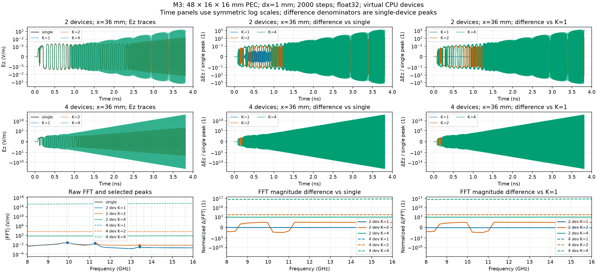

# Exchange interval: PEC CPU measurements

UTC: 2026-09-22T02:07:14.424621+00:00. Branch `agent/distributed-exchange-interval`; HEAD `cc282903b36df1a1d739ad2bdad930d164290152`; origin/main `cc282903b36df1a1d739ad2bdad930d164290152`.

## Reproduction

```sh
cd /Users/byungkwankim/Documents/rfx-worktrees/dist-exchange-interval
JAX_PLATFORMS=cpu XLA_FLAGS=--xla_force_host_platform_device_count=4 PYTHONPATH=$PWD /Users/byungkwankim/Documents/rfx/.venv/bin/python scripts/diagnostics/measure_exchange_interval_error.py
JAX_PLATFORMS=cpu XLA_FLAGS=--xla_force_host_platform_device_count=4 PYTHONPATH=$PWD /Users/byungkwankim/Documents/rfx/.venv/bin/python scripts/diagnostics/measure_exchange_interval_error.py --case M3 --device-count 4
```

These are the recorded measurement invocations. The final script's first command alone runs all 18 configurations; the second command appended the 4-device M3 batch to the initial measurements.

Analysis-only command:

```sh
JAX_PLATFORMS=cpu XLA_FLAGS=--xla_force_host_platform_device_count=4 PYTHONPATH=$PWD /Users/byungkwankim/Documents/rfx/.venv/bin/python scripts/diagnostics/measure_exchange_interval_error.py --analyze-only --output /tmp/rfx-K
```

## Configuration and definitions

PEC vacuum box: 48 × 16 × 16 mm; dx=1 mm; float32 Yee fields; `GaussianPulse(f0=8e9, bandwidth=0.5, amplitude=1.0, cutoff=3.0)`; soft Ez source at (10,8,8) mm, `amplitude_kind='field'` (the PEC legacy field-increment convention). `freq_max=16e9`, `cpml_layers=0`, `skip_preflight=True`. No solver or test changes.

M1: 400 steps, x=12,24,26,36 mm probes, 2 and 4 devices. M2: 800 steps, the same four probes, 2 devices. M3: 2000 steps, x=36 mm probe, 2 and 4 devices. All probes have y=z=8 mm. Each measurement batch reuses one Simulation object; all configurations use the same fixture. The 4-device M3 batch was run separately after the initial M1/M2/2-device-M3 batch.

The realized grid is 49 × 17 × 17 nodes (48 × 16 × 16 intervals). Two devices use 25 x-nodes per padded slab, one padding node, seam at x=25 mm. Four devices use 13 x-nodes per padded slab, three padding nodes, seams at x=13,26,39 mm. Ghost width is 1 node. The requested x=24 mm probe is retained; its realized index is 24, adjacent to the 2-device seam. These coordinates were not moved.

Trace comparisons use the first timed repeat. For either reference, max ratio = max(abs(distributed−reference))/max(abs(single)); dB = 20 log10(max ratio). RMS ratio = RMS(distributed−reference)/RMS(single). Both denominators use the single trace at that probe. Subtractions and reductions use float64; stored samples are float32. The crossing is the first zero-based source/scan step index with abs(diff)>0.001×single peak; time=index×dt. Samples are recorded after that step's field update. JSON also records the one-based completed step. ‘—’ means no crossing/not applicable/undefined; −∞ dB denotes an exactly zero ratio. JSON uses strings for infinities and null for undefined values.

Timings are synchronized public `sim.run` wall time plus transfer/copy of the probe trace, including setup and any tracing/compilation performed by that call. All returned field arrays and traces are blocked before stopping the timer. One full-length warmup per configuration precedes five timed repeats; configuration order rotates by one each round. No concurrent simulation processes are used. Ratios are t(K)/t(K=1) and t(distributed)/t(single); these are elapsed-time ratios. CPU timings do not transfer to GPU.

Environment: `{"JAX_PLATFORMS": "cpu", "PYTHONPATH": "/Users/byungkwankim/Documents/rfx-worktrees/dist-exchange-interval", "XLA_FLAGS": "--xla_force_host_platform_device_count=4", "cpu": "arm", "executable": "/Users/byungkwankim/Documents/rfx/.venv/bin/python", "jax_devices": ["cpu:0", "cpu:1", "cpu:2", "cpu:3"], "jax_enable_x64": false, "jax_version": "0.10.2", "logical_cpu_count": 10, "numpy_version": "2.4.6", "platform": "macOS-26.5.2-arm64-arm-64bit", "python": "3.11.2 (v3.11.2:878ead1ac1, Feb  7 2023, 10:02:41) [Clang 13.0.0 (clang-1300.0.29.30)]", "rfx_file": "/Users/byungkwankim/Documents/rfx-worktrees/dist-exchange-interval/rfx/__init__.py"}`

## Summary rows

| M | devices | K | reference | worst max ratio (dB) | max |peak shift| (%) | max |peak change| (dB) | median (s) | t/tK1 | t/tsingle |
| --- | --- | --- | --- | --- | --- | --- | --- | --- | --- |
| M1 | 2 | 1 | vs_single | -53.6564 | — | — | 0.305268 | 1 | 2.00987 |
| M1 | 2 | 1 | vs_K1 | −∞ | — | — | 0.305268 | 1 | 2.00987 |
| M1 | 2 | 2 | vs_single | -16.0335 | — | — | 0.274274 | 0.898468 | 1.8058 |
| M1 | 2 | 2 | vs_K1 | -16.0422 | — | — | 0.274274 | 0.898468 | 1.8058 |
| M1 | 2 | 4 | vs_single | -1.7655 | — | — | 0.260961 | 0.854857 | 1.71815 |
| M1 | 2 | 4 | vs_K1 | -1.76481 | — | — | 0.260961 | 0.854857 | 1.71815 |
| M1 | 4 | 1 | vs_single | -53.6564 | — | — | 0.44605 | 1 | 2.93677 |
| M1 | 4 | 1 | vs_K1 | −∞ | — | — | 0.44605 | 1 | 2.93677 |
| M1 | 4 | 2 | vs_single | -9.55968 | — | — | 0.340422 | 0.763193 | 2.24132 |
| M1 | 4 | 2 | vs_K1 | -9.51887 | — | — | 0.340422 | 0.763193 | 2.24132 |
| M1 | 4 | 4 | vs_single | 38.5583 | — | — | 0.324544 | 0.727596 | 2.13678 |
| M1 | 4 | 4 | vs_K1 | 38.5585 | — | — | 0.324544 | 0.727596 | 2.13678 |
| M2 | 2 | 1 | vs_single | -53.9134 | — | — | 0.420117 | 1 | 2.54661 |
| M2 | 2 | 1 | vs_K1 | −∞ | — | — | 0.420117 | 1 | 2.54661 |
| M2 | 2 | 2 | vs_single | -8.31589 | — | — | 0.366751 | 0.872974 | 2.22313 |
| M2 | 2 | 2 | vs_K1 | -8.30981 | — | — | 0.366751 | 0.872974 | 2.22313 |
| M2 | 2 | 4 | vs_single | 10.435 | — | — | 0.34784 | 0.827961 | 2.1085 |
| M2 | 2 | 4 | vs_K1 | 10.4347 | — | — | 0.34784 | 0.827961 | 2.1085 |
| M3 | 2 | 1 | vs_single | -51.9828 | 0.000213054 | 0.00217474 | 0.812432 | 1 | 3.82415 |
| M3 | 2 | 1 | vs_K1 | −∞ | 0 | 0 | 0.812432 | 1 | 3.82415 |
| M3 | 2 | 2 | vs_single | 46.2349 | 0.136756 | 14.7149 | 0.503406 | 0.619629 | 2.36955 |
| M3 | 2 | 2 | vs_K1 | 46.2349 | 0.136755 | 14.7127 | 0.503406 | 0.619629 | 2.36955 |
| M3 | 2 | 4 | vs_single | 108.534 | — | — | 0.445075 | 0.547831 | 2.09499 |
| M3 | 2 | 4 | vs_K1 | 108.534 | — | — | 0.445075 | 0.547831 | 2.09499 |
| M3 | 4 | 1 | vs_single | -51.9828 | 0.000213054 | 0.00217474 | 1.07961 | 1 | 5.08178 |
| M3 | 4 | 1 | vs_K1 | −∞ | 0 | 0 | 1.07961 | 1 | 5.08178 |
| M3 | 4 | 2 | vs_single | 153.304 | — | — | 0.740444 | 0.685841 | 3.4853 |
| M3 | 4 | 2 | vs_K1 | 153.304 | — | — | 0.740444 | 0.685841 | 3.4853 |
| M3 | 4 | 4 | vs_single | 394.456 | — | — | 0.554859 | 0.513942 | 2.61174 |
| M3 | 4 | 4 | vs_K1 | 394.456 | — | — | 0.554859 | 0.513942 | 2.61174 |

## M1: traces and timings

dt=1.90657486953e-12 s; record length=0.762629948 ns; last sample time=0.760723373 ns.

| run | warmup (s) | five repeats (s) | median (s) | max repeat difference (V/m) |
| --- | --- | --- | --- | --- |
| M1_single | 0.42864 | 0.140516, 0.137723, 0.174186, 0.199756, 0.151884 | 0.151884 | 0 |
| M1_d2_K1 | 0.692583 | 0.280463, 0.376305, 0.36471, 0.283678, 0.305268 | 0.305268 | 0 |
| M1_d2_K2 | 0.248179 | 0.260768, 0.274274, 0.24023, 0.320607, 0.333633 | 0.274274 | 0 |
| M1_d2_K4 | 0.24737 | 0.260961, 0.409328, 0.219718, 0.25636, 0.291735 | 0.260961 | 0 |
| M1_d4_K1 | 0.771323 | 0.432423, 0.672244, 0.449285, 0.44605, 0.418113 | 0.44605 | 0 |
| M1_d4_K2 | 0.331226 | 0.340422, 0.380498, 0.428794, 0.328033, 0.31981 | 0.340422 | 0 |
| M1_d4_K4 | 0.290595 | 0.341288, 0.28033, 0.32211, 0.324544, 0.471873 | 0.324544 | 0 |

| run | reference | probe x (mm) | single peak (V/m) | max ratio (1) | max ratio (dB) | RMS ratio (1) | first step (0-based) | first time (ns) | finite |
| --- | --- | --- | --- | --- | --- | --- | --- | --- | --- |
| M1_d2_K1 | vs_single | 12 | 0.573152 | 1.06971e-06 | -119.415 | 7.85542e-07 | — | — | true |
| M1_d2_K1 | vs_single | 24 | 0.000421774 | 0.000683454 | -63.3058 | 0.000482439 | — | — | true |
| M1_d2_K1 | vs_single | 26 | 0.000300864 | 0.000865336 | -61.2563 | 0.000600302 | — | — | true |
| M1_d2_K1 | vs_single | 36 | 0.000170065 | 0.00207577 | -53.6564 | 0.00109388 | 212 | 0.404194 | true |
| M1_d2_K1 | vs_K1 | 12 | 0.573152 | 0 | −∞ | 0 | — | — | true |
| M1_d2_K1 | vs_K1 | 24 | 0.000421774 | 0 | −∞ | 0 | — | — | true |
| M1_d2_K1 | vs_K1 | 26 | 0.000300864 | 0 | −∞ | 0 | — | — | true |
| M1_d2_K1 | vs_K1 | 36 | 0.000170065 | 0 | −∞ | 0 | — | — | true |
| M1_d2_K2 | vs_single | 12 | 0.573152 | 4.33623e-05 | -87.2578 | 3.76212e-05 | — | — | true |
| M1_d2_K2 | vs_single | 24 | 0.000421774 | 0.0846174 | -21.4508 | 0.0787637 | 33 | 0.062917 | true |
| M1_d2_K2 | vs_single | 26 | 0.000300864 | 0.0996108 | -20.0339 | 0.0923034 | 32 | 0.0610104 | true |
| M1_d2_K2 | vs_single | 36 | 0.000170065 | 0.157879 | -16.0335 | 0.101368 | 50 | 0.0953287 | true |
| M1_d2_K2 | vs_K1 | 12 | 0.573152 | 4.3102e-05 | -87.31 | 3.76398e-05 | — | — | true |
| M1_d2_K2 | vs_K1 | 24 | 0.000421774 | 0.0844562 | -21.4674 | 0.0787868 | 33 | 0.062917 | true |
| M1_d2_K2 | vs_K1 | 26 | 0.000300864 | 0.0992929 | -20.0616 | 0.0923028 | 32 | 0.0610104 | true |
| M1_d2_K2 | vs_K1 | 36 | 0.000170065 | 0.157721 | -16.0422 | 0.101377 | 50 | 0.0953287 | true |
| M1_d2_K4 | vs_single | 12 | 0.573152 | 0.00023126 | -72.718 | 0.000220419 | — | — | true |
| M1_d2_K4 | vs_single | 24 | 0.000421774 | 0.816066 | -1.7655 | 0.58857 | 29 | 0.0552907 | true |
| M1_d2_K4 | vs_single | 26 | 0.000300864 | 0.33896 | -9.39703 | 0.369149 | 24 | 0.0457578 | true |
| M1_d2_K4 | vs_single | 36 | 0.000170065 | 0.388212 | -8.21862 | 0.279214 | 43 | 0.0819827 | true |
| M1_d2_K4 | vs_K1 | 12 | 0.573152 | 0.000232078 | -72.6873 | 0.00022045 | — | — | true |
| M1_d2_K4 | vs_K1 | 24 | 0.000421774 | 0.81613 | -1.76481 | 0.588566 | 29 | 0.0552907 | true |
| M1_d2_K4 | vs_K1 | 26 | 0.000300864 | 0.338983 | -9.39644 | 0.369147 | 24 | 0.0457578 | true |
| M1_d2_K4 | vs_K1 | 36 | 0.000170065 | 0.389081 | -8.19921 | 0.279236 | 43 | 0.0819827 | true |
| M1_d4_K1 | vs_single | 12 | 0.573152 | 1.06971e-06 | -119.415 | 7.85542e-07 | — | — | true |
| M1_d4_K1 | vs_single | 24 | 0.000421774 | 0.000683454 | -63.3058 | 0.000482439 | — | — | true |
| M1_d4_K1 | vs_single | 26 | 0.000300864 | 0.000865336 | -61.2563 | 0.000600302 | — | — | true |
| M1_d4_K1 | vs_single | 36 | 0.000170065 | 0.00207577 | -53.6564 | 0.00109388 | 212 | 0.404194 | true |
| M1_d4_K1 | vs_K1 | 12 | 0.573152 | 0 | −∞ | 0 | — | — | true |
| M1_d4_K1 | vs_K1 | 24 | 0.000421774 | 0 | −∞ | 0 | — | — | true |
| M1_d4_K1 | vs_K1 | 26 | 0.000300864 | 0 | −∞ | 0 | — | — | true |
| M1_d4_K1 | vs_K1 | 36 | 0.000170065 | 0 | −∞ | 0 | — | — | true |
| M1_d4_K2 | vs_single | 12 | 0.573152 | 0.00731144 | -42.7199 | 0.00565696 | 66 | 0.125834 | true |
| M1_d4_K2 | vs_single | 24 | 0.000421774 | 0.182451 | -14.7771 | 0.100126 | 30 | 0.0571972 | true |
| M1_d4_K2 | vs_single | 26 | 0.000300864 | 0.279017 | -11.0874 | 0.21554 | 30 | 0.0571972 | true |
| M1_d4_K2 | vs_single | 36 | 0.000170065 | 0.332672 | -9.55968 | 0.156479 | 48 | 0.0915156 | true |
| M1_d4_K2 | vs_K1 | 12 | 0.573152 | 0.00731175 | -42.7196 | 0.0056572 | 66 | 0.125834 | true |
| M1_d4_K2 | vs_K1 | 24 | 0.000421774 | 0.182018 | -14.7977 | 0.100142 | 30 | 0.0571972 | true |
| M1_d4_K2 | vs_K1 | 26 | 0.000300864 | 0.279015 | -11.0874 | 0.215528 | 30 | 0.0571972 | true |
| M1_d4_K2 | vs_K1 | 36 | 0.000170065 | 0.334238 | -9.51887 | 0.156554 | 48 | 0.0915156 | true |
| M1_d4_K4 | vs_single | 12 | 0.573152 | 0.0901497 | -20.9007 | 0.0882429 | 44 | 0.0838893 | true |
| M1_d4_K4 | vs_single | 24 | 0.000421774 | 22.4245 | 27.0145 | 12.2002 | 23 | 0.0438512 | true |
| M1_d4_K4 | vs_single | 26 | 0.000300864 | 59.5076 | 35.4914 | 24.7828 | 26 | 0.0495709 | true |
| M1_d4_K4 | vs_single | 36 | 0.000170065 | 84.7065 | 38.5583 | 32.8672 | 42 | 0.0800761 | true |
| M1_d4_K4 | vs_K1 | 12 | 0.573152 | 0.0901502 | -20.9007 | 0.0882433 | 44 | 0.0838893 | true |
| M1_d4_K4 | vs_K1 | 24 | 0.000421774 | 22.4243 | 27.0144 | 12.2003 | 23 | 0.0438512 | true |
| M1_d4_K4 | vs_K1 | 26 | 0.000300864 | 59.5073 | 35.4914 | 24.7827 | 26 | 0.0495709 | true |
| M1_d4_K4 | vs_K1 | 36 | 0.000170065 | 84.7081 | 38.5585 | 32.8675 | 42 | 0.0800761 | true |


## M2: traces and timings

dt=1.90657486953e-12 s; record length=1.5252599 ns; last sample time=1.52335332 ns.

| run | warmup (s) | five repeats (s) | median (s) | max repeat difference (V/m) |
| --- | --- | --- | --- | --- |
| M2_single | 0.362279 | 0.149007, 0.181652, 0.164971, 0.174537, 0.156856 | 0.164971 | 0 |
| M2_d2_K1 | 0.418783 | 0.420117, 0.541303, 0.395787, 0.591022, 0.385126 | 0.420117 | 0 |
| M2_d2_K2 | 0.307405 | 0.384765, 0.473293, 0.366751, 0.305133, 0.301478 | 0.366751 | 0 |
| M2_d2_K4 | 0.39189 | 0.34784, 0.265809, 0.387389, 0.481021, 0.276651 | 0.34784 | 0 |

| run | reference | probe x (mm) | single peak (V/m) | max ratio (1) | max ratio (dB) | RMS ratio (1) | first step (0-based) | first time (ns) | finite |
| --- | --- | --- | --- | --- | --- | --- | --- | --- | --- |
| M2_d2_K1 | vs_single | 12 | 0.573152 | 1.06971e-06 | -119.415 | 1.19218e-06 | — | — | true |
| M2_d2_K1 | vs_single | 24 | 0.000421774 | 0.000768041 | -62.2923 | 0.00061162 | — | — | true |
| M2_d2_K1 | vs_single | 26 | 0.000300864 | 0.00137435 | -57.238 | 0.000853103 | 512 | 0.976166 | true |
| M2_d2_K1 | vs_single | 36 | 0.000175171 | 0.00201526 | -53.9134 | 0.00111777 | 212 | 0.404194 | true |
| M2_d2_K1 | vs_K1 | 12 | 0.573152 | 0 | −∞ | 0 | — | — | true |
| M2_d2_K1 | vs_K1 | 24 | 0.000421774 | 0 | −∞ | 0 | — | — | true |
| M2_d2_K1 | vs_K1 | 26 | 0.000300864 | 0 | −∞ | 0 | — | — | true |
| M2_d2_K1 | vs_K1 | 36 | 0.000175171 | 0 | −∞ | 0 | — | — | true |
| M2_d2_K2 | vs_single | 12 | 0.573152 | 9.63673e-05 | -80.3214 | 8.15219e-05 | — | — | true |
| M2_d2_K2 | vs_single | 24 | 0.000421774 | 0.195651 | -14.1703 | 0.146754 | 33 | 0.062917 | true |
| M2_d2_K2 | vs_single | 26 | 0.000300864 | 0.271315 | -11.3305 | 0.157336 | 32 | 0.0610104 | true |
| M2_d2_K2 | vs_single | 36 | 0.000175171 | 0.383889 | -8.31589 | 0.142274 | 50 | 0.0953287 | true |
| M2_d2_K2 | vs_K1 | 12 | 0.573152 | 9.60142e-05 | -80.3533 | 8.15257e-05 | — | — | true |
| M2_d2_K2 | vs_K1 | 24 | 0.000421774 | 0.195983 | -14.1556 | 0.14677 | 33 | 0.062917 | true |
| M2_d2_K2 | vs_K1 | 26 | 0.000300864 | 0.271201 | -11.3342 | 0.157286 | 32 | 0.0610104 | true |
| M2_d2_K2 | vs_K1 | 36 | 0.000175171 | 0.384158 | -8.30981 | 0.142248 | 50 | 0.0953287 | true |
| M2_d2_K4 | vs_single | 12 | 0.573152 | 0.00128907 | -57.7944 | 0.00092966 | 729 | 1.38989 | true |
| M2_d2_K4 | vs_single | 24 | 0.000421774 | 2.67861 | 8.5582 | 1.65215 | 29 | 0.0552907 | true |
| M2_d2_K4 | vs_single | 26 | 0.000300864 | 3.32469 | 10.435 | 1.52219 | 24 | 0.0457578 | true |
| M2_d2_K4 | vs_single | 36 | 0.000175171 | 3.27098 | 10.2936 | 1.42604 | 43 | 0.0819827 | true |
| M2_d2_K4 | vs_K1 | 12 | 0.573152 | 0.00128919 | -57.7937 | 0.000929646 | 729 | 1.38989 | true |
| M2_d2_K4 | vs_K1 | 24 | 0.000421774 | 2.67877 | 8.55872 | 1.65214 | 29 | 0.0552907 | true |
| M2_d2_K4 | vs_K1 | 26 | 0.000300864 | 3.32458 | 10.4347 | 1.52218 | 24 | 0.0457578 | true |
| M2_d2_K4 | vs_K1 | 36 | 0.000175171 | 3.27175 | 10.2956 | 1.42607 | 43 | 0.0819827 | true |


## M3: traces and timings

dt=1.90657486953e-12 s; record length=3.81314974 ns; last sample time=3.81124316 ns.

| run | warmup (s) | five repeats (s) | median (s) | max repeat difference (V/m) |
| --- | --- | --- | --- | --- |
| M3_single | 0.410785 | 0.239201, 0.212448, 0.206753, 0.265451, 0.211451 | 0.212448 | 0 |
| M3_d2_K1 | 0.857196 | 0.812432, 0.944012, 0.888975, 0.740528, 0.5952 | 0.812432 | 0 |
| M3_d2_K2 | 0.627151 | 0.494443, 0.773874, 0.524871, 0.503406, 0.443447 | 0.503406 | 0 |
| M3_d2_K4 | 0.546286 | 0.430371, 0.609751, 0.445075, 0.560968, 0.371746 | 0.445075 | 0 |
| M3_d4_K1 | 1.96288 | 1.22919, 1.0653, 1.23147, 1.07961, 1.07078 | 1.07961 | 0 |
| M3_d4_K2 | 0.960064 | 0.846155, 0.740444, 0.659635, 0.805217, 0.735456 | 0.740444 | 0 |
| M3_d4_K4 | 0.554643 | 0.613683, 0.524164, 0.603301, 0.554859, 0.508343 | 0.554859 | 0 |

| run | reference | probe x (mm) | single peak (V/m) | max ratio (1) | max ratio (dB) | RMS ratio (1) | first step (0-based) | first time (ns) | finite |
| --- | --- | --- | --- | --- | --- | --- | --- | --- | --- |
| M3_d2_K1 | vs_single | 36 | 0.000175171 | 0.00251687 | -51.9828 | 0.0011993 | 212 | 0.404194 | true |
| M3_d2_K1 | vs_K1 | 36 | 0.000175171 | 0 | −∞ | 0 | — | — | true |
| M3_d2_K2 | vs_single | 36 | 0.000175171 | 204.996 | 46.2349 | 67.3434 | 50 | 0.0953287 | true |
| M3_d2_K2 | vs_K1 | 36 | 0.000175171 | 204.997 | 46.2349 | 67.3434 | 50 | 0.0953287 | true |
| M3_d2_K4 | vs_single | 36 | 0.000175171 | 267122 | 108.534 | 78306.5 | 43 | 0.0819827 | true |
| M3_d2_K4 | vs_K1 | 36 | 0.000175171 | 267122 | 108.534 | 78306.5 | 43 | 0.0819827 | true |
| M3_d4_K1 | vs_single | 36 | 0.000175171 | 0.00251687 | -51.9828 | 0.0011993 | 212 | 0.404194 | true |
| M3_d4_K1 | vs_K1 | 36 | 0.000175171 | 0 | −∞ | 0 | — | — | true |
| M3_d4_K2 | vs_single | 36 | 0.000175171 | 4.62572e+07 | 153.304 | 9.29038e+06 | 48 | 0.0915156 | true |
| M3_d4_K2 | vs_K1 | 36 | 0.000175171 | 4.62572e+07 | 153.304 | 9.29038e+06 | 48 | 0.0915156 | true |
| M3_d4_K4 | vs_single | 36 | 0.000175171 | 5.28191e+19 | 394.456 | 7.31693e+18 | 42 | 0.0800761 | true |
| M3_d4_K4 | vs_K1 | 36 | 0.000175171 | 5.28191e+19 | 394.456 | 7.31693e+18 | 42 | 0.0800761 | true |



## M3: FFT peaks and analytic frequencies

Spectrum: abs(rFFT(Ez)), all 2000 samples, no detrending, no taper, no zero-padding, no amplitude normalization. FFT magnitude units are V/m (the unnormalized sum of field samples). Search band is explicitly 8–16 GHz. All local maxima in the band are retained in JSON; the lowest three are tabulated. No prominence threshold is imposed. At bin i, δ=(A[i−1]−A[i+1])/[2(A[i−1]−2A[i]+A[i+1])]; f=(i+δ)/(N dt), Apeak=A[i]−(A[i−1]−A[i+1])δ/4. Comparisons pair peaks by ascending frequency rank; this does not establish physical mode identity. The nearest analytic frequency is a numeric nearest-neighbor annotation, not a mode assignment.

Analytic PEC frequencies: f=(c/2)√[(m/Lx)²+(n/Ly)²+(p/Lz)²], c=299792458 m/s. TE/TM are defined relative to z: TE has m,n≥0, m+n>0, p≥1; TM has m,n≥1, p≥0. TE has Ez=0. For TM the Ez spatial factor is sin(mπx/Lx)sin(nπy/Ly)cos(pπz/Lz). See [Purdue, Cavity Resonators, §21.2](https://engineering.purdue.edu/wcchew/ece604f20/Lecture%20Notes/Lect21.pdf).

| run | peak rank | measured (GHz) | |FFT| (V/m) | nearest analytic modes | analytic (GHz) | offset from analytic (%) |
| --- | --- | --- | --- | --- | --- | --- |
| M3_single | 1 | 9.92400947 | 0.0915803962 | TE(1,0,1), TM(1,1,0) | 9.87528117 | 0.493437 |
| M3_single | 2 | 11.262668 | 0.044828172 | TE(2,0,1), TM(2,1,0) | 11.2595529 | 0.0276664 |
| M3_single | 3 | 13.4197179 | 0.00126862978 | TE(0,1,1), TE(3,0,1), TM(3,1,0) | 13.24908 | 1.28792 |
| M3_d2_K1 | 1 | 9.92400951 | 0.0915804636 | TE(1,0,1), TM(1,1,0) | 9.87528117 | 0.493437 |
| M3_d2_K1 | 2 | 11.2626681 | 0.0448285106 | TE(2,0,1), TM(2,1,0) | 11.2595529 | 0.027667 |
| M3_d2_K1 | 3 | 13.4196893 | 0.00126894745 | TE(0,1,1), TE(3,0,1), TM(3,1,0) | 13.24908 | 1.28771 |
| M3_d2_K2 | 1 | 9.91481815 | 0.0978624929 | TE(1,0,1), TM(1,1,0) | 9.87528117 | 0.400363 |
| M3_d2_K2 | 2 | 11.2780704 | 0.05176152 | TE(2,0,1), TM(2,1,0) | 11.2595529 | 0.16446 |
| M3_d2_K2 | 3 | 13.4142998 | 0.00690365641 | TE(0,1,1), TE(3,0,1), TM(3,1,0) | 13.24908 | 1.24703 |
| M3_d4_K1 | 1 | 9.92400951 | 0.0915804636 | TE(1,0,1), TM(1,1,0) | 9.87528117 | 0.493437 |
| M3_d4_K1 | 2 | 11.2626681 | 0.0448285106 | TE(2,0,1), TM(2,1,0) | 11.2595529 | 0.027667 |
| M3_d4_K1 | 3 | 13.4196893 | 0.00126894745 | TE(0,1,1), TE(3,0,1), TM(3,1,0) | 13.24908 | 1.28771 |

| run | reference | peak rank | frequency shift (%) | peak magnitude change (dB) |
| --- | --- | --- | --- | --- |
| M3_d2_K1 | vs_single | 1 | 4.22101e-07 | 6.3964e-06 |
| M3_d2_K1 | vs_single | 2 | 6.40994e-07 | 6.5608e-05 |
| M3_d2_K1 | vs_single | 3 | -0.000213054 | 0.00217474 |
| M3_d2_K1 | vs_K1 | 1 | 0 | 0 |
| M3_d2_K1 | vs_K1 | 2 | 0 | 0 |
| M3_d2_K1 | vs_K1 | 3 | 0 | 0 |
| M3_d2_K2 | vs_single | 1 | -0.092617 | 0.576275 |
| M3_d2_K2 | vs_single | 2 | 0.136756 | 1.24912 |
| M3_d2_K2 | vs_single | 3 | -0.0403742 | 14.7149 |
| M3_d2_K2 | vs_K1 | 1 | -0.0926175 | 0.576269 |
| M3_d2_K2 | vs_K1 | 2 | 0.136755 | 1.24905 |
| M3_d2_K2 | vs_K1 | 3 | -0.0401612 | 14.7127 |
| M3_d4_K1 | vs_single | 1 | 4.22101e-07 | 6.3964e-06 |
| M3_d4_K1 | vs_single | 2 | 6.40994e-07 | 6.5608e-05 |
| M3_d4_K1 | vs_single | 3 | -0.000213054 | 0.00217474 |
| M3_d4_K1 | vs_K1 | 1 | 0 | 0 |
| M3_d4_K1 | vs_K1 | 2 | 0 | 0 |
| M3_d4_K1 | vs_K1 | 3 | 0 | 0 |

All analytic TE/TM modes in 8–16 GHz:

| mode (x,y,z indices) | frequency (GHz) | ideal Ez source×probe factor (1) |
| --- | --- | --- |
| TE(1,0,1) | 9.87528117 | 0 |
| TM(1,1,0) | 9.87528117 | 0.430459 |
| TE(2,0,1) | 11.2595529 | 0 |
| TM(2,1,0) | 11.2595529 | -0.965926 |
| TE(0,1,1) | 13.24908 | 0 |
| TE(3,0,1) | 13.24908 | 0 |
| TM(3,1,0) | 13.24908 | 0.653281 |
| TE(1,1,1) | 13.6121357 | 0 |
| TM(1,1,1) | 13.6121357 | 1.61396e-33 |
| TE(2,1,1) | 14.6474091 | 0 |
| TM(2,1,1) | 14.6474091 | -3.62164e-33 |
| TE(4,0,1) | 15.6141905 | 0 |
| TM(4,1,0) | 15.6141905 | 1.07188e-15 |

## Files and completion

- Script: `/Users/byungkwankim/Documents/rfx-worktrees/dist-exchange-interval/scripts/diagnostics/measure_exchange_interval_error.py` (uncommitted).
- All trace samples and FFT magnitudes: `/tmp/rfx-K/traces.npz`.
  Keys M1/M2/M3_single and M1/M2/M3_dN_KK hold first timed repeats; suffixes _warmup and _repeat1 through _repeat5 hold every run. _time_s arrays use index×dt; M3_frequency_Hz and _fft_magnitude_V_per_m hold spectra.
- Full metrics: `/tmp/rfx-K/results.json`; run provenance: `/tmp/rfx-K/run_manifest.json`.
- Figure: [M1.png](M1.png).
- Figure: [M2.png](M2.png).
- Figure: [M3.png](M3.png).
- Report: `/tmp/rfx-K/REPORT.md`.
- Did not run: none.
- Unavailable spectral results: M3_d2_K4: 0 local maxima in 8-16 GHz; missing peak frequencies and their shifts/magnitude changes are undefined; M3_d4_K2: 0 local maxima in 8-16 GHz; missing peak frequencies and their shifts/magnitude changes are undefined; M3_d4_K4: 0 local maxima in 8-16 GHz; missing peak frequencies and their shifts/magnitude changes are undefined
- Longest individual warmup/timed call: 1.962878 s.
- Runner warning text, if emitted, is preserved verbatim in JSON as provenance.
